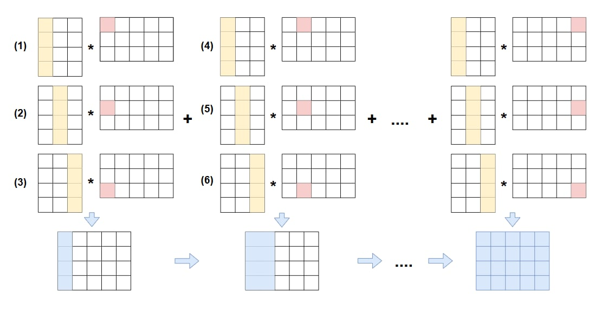
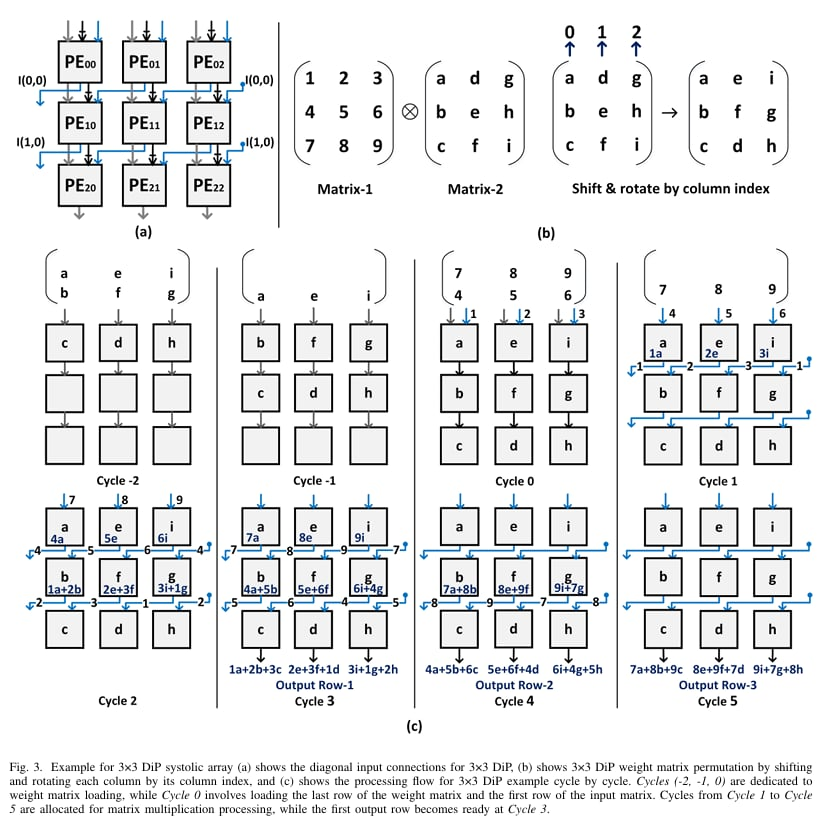
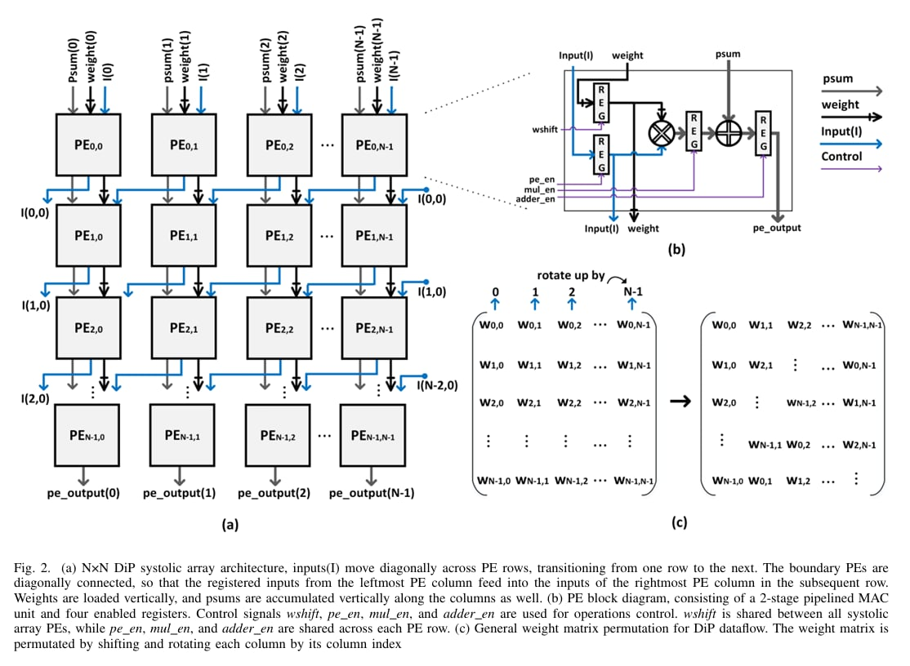
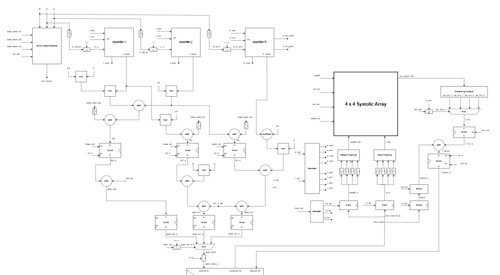

# DiP Architecture of Systolic Array for Matrix Multiplication Acceleration

## Overview
This repository contains the RTL design, verification, and hardware implementation of a scalable, energy-efficient systolic array based on the **DiP (Diagonal-Input and Permutated weight-stationary)** dataflow. 

While traditional AI hardware accelerators (like TPUs) utilize Weight Stationary systolic arrays, they heavily rely on synchronous First-In-First-Out buffers for input-output synchronization. These FIFOs consume significant chip area and power. Our implementation of the DiP architecture completely eliminates these synchronization FIFOs, leading to massive improvements in energy efficiency and up to a 50% increase in throughput by maximizing computational resource utilization.

This project is a hardware realization based on the 2025 IEEE research paper: *DiP: A Scalable, Energy-Efficient Systolic Array for Matrix Multiplication Acceleration*.

---

## Algorithm & Dataflow

### 1. Matrix Tiling Algorithm
To handle large matrices on a constrained hardware footprint, we implemented a matrix tiling algorithm. The matrices are divided into smaller blocks (tiles) that fit into our 4x4 on-chip systolic array.

### 2. The DiP Dataflow
The core innovation of this project is the DiP dataflow, which features two main mechanisms:

 - Weight Matrix Permutation: While the original paper relies on weights being pre-rotated in software prior to loading, our design implements this permutation directly in hardware. We designed custom address generation logic that calculates specific read addresses on-the-fly, fetching the weights from memory in their correctly rotated and shifted order without requiring any software preprocessing.

 - Diagonal Input Movement: Inputs are fed into the first row and shifted diagonally in subsequent cycles.

Source: [Abdelmaksoud et al., 2024]([https://arxiv.org/abs/2412.09709])

## Hardware Architecture & RTL Design

The system is designed using a Finite State Machine with Datapath (FSMD) model, separating the control logic from the computational logic.

### 1. Datapath Architecture

The datapath manages the flow of matrices from the Block RAM (BRAM) through the Processing Elements (PEs) and back. It consists of the following subsystems:

 - Processing Element (PE): A 2-stage pipelined Multiply-Accumulate (MAC) unit with independent control registers for inputs, weights, and accumulation results.

Source: [Abdelmaksoud et al., 2024]([https://arxiv.org/abs/2412.09709])

 - Address Generation Unit: Calculates dynamic memory addresses for continuous data streaming.

 - Accumulator (Partial Sum Addition): Retrieves temporarily stored data (partial sums) from memory and adds it to the newly computed MAC results to accumulate the final output matrix.

### 2. Finite State Machine (FSM) Controller

The Control Unit is a robust 59-state FSM that orchestrates the entire matrix multiplication process, coordinating the i, j, and h loops of the tiled algorithm.

To hide memory latency and maximize PE utilization, the FSM implements a 3-layer pipeline:

 - Load Pipeline: Fetching and writing weights into the PEs.

 - Stream Pipeline: Streaming diagonal inputs into the array.

 - Compute & Write-back Pipeline: Processing the MAC operations and storing results back to BRAM.

## Performance & FPGA Implementation

The design was fully verified via Behavioral Simulation and deployed on hardware using **Xilinx ILA/VIO** (Integrated Logic Analyzer / Virtual Input/Output). Below are the post-implementation reports extracted from Xilinx Vivado.

### 1. Post-Implementation Timing Summary
The design successfully met all timing constraints at a target clock frequency of **100 MHz**.

| Setup (Max Delay) | Hold (Min Delay) |
| :--- | :--- |
| **WNS** (Worst Negative Slack): `+3.682 ns` | **WHS** (Worst Hold Slack): `+0.067 ns` |
| **TNS** (Total Negative Slack): `0.000 ns` | **THS** (Total Hold Slack): `0.000 ns` |
| **Timing Met:** Yes | **Timing Met:** Yes |

### 2. Resource Utilization (4x4 Systolic Array)

| Site Type | Used | Available | Utilization (%) |
| :--- | :--- | :--- | :--- |
| **LUTs** | 1,694 | 20,800 | ~8.1% |
| **FF** | 1,201 | 41,600 | ~2.9% |

## Contributors

| Name | Role & Contribution | 
| :--- | :--- |
| Nguyen Tien Dung | Research algorithms for addressing and data flow; Design FSMD; Design and model Datapath using HDL; Design Controller; Software-based design debugging. |
| Vu Anh Tuan | Research algorithms and model Systolic arrays using HDL; Design and model Controller using HDL. |
| Pham Van Duy | Research algorithms and model Systolic arrays using HDL; Write testbenches; Research ILA/VIO; Hardware-based design debugging. |

## Supervisor: Nguyen Kiem Hung, Ph.D. - AICS Lab - VNU-UET.
